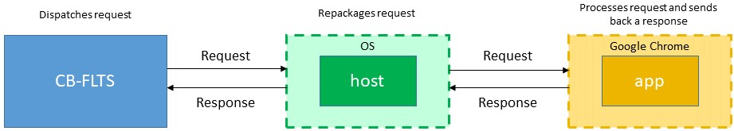

# Chrome Bridge
A Google Chrome application that enables the CB-FLTS to remotely communicate with the browser when used in the context of viewing PDF documents. 

The application is made up of two sub-components:
1. *app* - A Google Chrome extension that performs specific operations requested by the CB-FLTS. These operations include renaming and closing of tabs, or disabling right-click menu when viewing PDFs. The extension is written in JavaScript.
2. *host* - A native Python application that acts as a bridge by enabling message exchange between the CB-FLTS and the *app*. Commands from the CB-FLTS are sent to the *host* which repackages them to a well-defined structure that is processed by the *app*. The host is based on Google Chrome's [Native Messaging](https://developer.chrome.com/extensions/nativeMessaging) framework.

See the illustration below:

The requests and responses are in JSON format.