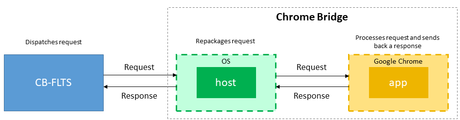

# Chrome Bridge
A Google Chrome application that enables the CB-FLTS to remotely communicate with the browser when used in the context of viewing PDF documents. 

The application is made up of two sub-components:
1. *app* - A Google Chrome extension that performs specific operations requested by the CB-FLTS. These operations include renaming and closing of tabs, or disabling right-click menu when viewing PDFs. The extension is written in JavaScript.
2. *host* - A native Python application that acts as a bridge by enabling message exchange between the CB-FLTS and the *app*. Command requests from the CB-FLTS are sent to the *host* which then repackages them to a well-defined structure before sending them to the *app* for processing. The host is based on Google Chrome's [Native Messaging](https://developer.chrome.com/extensions/nativeMessaging) framework.

See the illustration below:

The communication between the CB-FLTS and *host*, and that between *host* and *app* is based on TCP/IP sockets. The data exchange format for both requests and responses is JSON.

## Installation
*[Coming soon...]*.

## Configuration
In order for the CB-FLTS to communicate with the *host*, it needs to be know which port the host will be running on. To configure this port, follow the steps below:
1. Close any running instances of Google Chrome and CB-FLTS
2. Browse to the root folder containing the *host* application
3. Locate the file named **conf** and open it using any text editor
4. Change the number appearing next to **Number:**. So, for instance, to use port 9530 then the line should read **Number:9530**
5. Save and close the text editor
6. Restart Google Chrome and CB-FLTS

